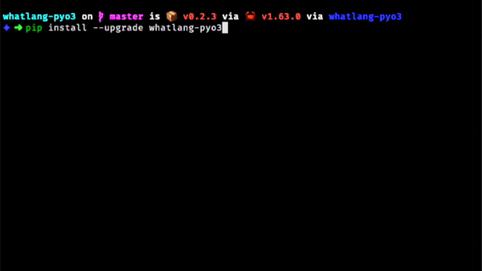

# Python Binding for WhatLang


[](https://badge.fury.io/py/whatlang-pyo3)
 
[](https://actions-badge.atrox.dev/omarmhaimdat/whatlang-pyo3/goto?ref=master)



WhatLang is a Python library for detecting the language of a text. It is based on the [WhatLang](https://github.com/greyblake/whatlang-rs) Rust library.

## Installation

```bash
pip install whatlang-pyo3
```

## Usage

### Detect

```python
>>> from whatlang import detect
>>> info = detect("This is written in English")
"Language: eng - Script: Latin - Confidence: 0.11450955767632877 - Is reliable: false"
>>> info.lang
"eng"
>>> info.script
"Latin"
>>> info.confidence
0.11450955767632877
>>> info.is_reliable
False
>>> info.to_iso()
"Language: en - Script: Latin - Confidence: 0.11450955767632877 - Is reliable: false"
```

### Detect language

You can also detect the language of a text without the script and the confidence.

```python
>>> from whatlang import detect_lang
>>> detect_lang("This is written in English")
"eng"
>>> detect_lang("Ceci est écrit en français")
"fra"
```

### Detect script

You can also detect the script of a text without the language and the confidence.


```python
>>> from whatlang import detect_script
>>> detect_script("This is written in English")
Name: Latin - Languages: spa, eng, por, ind, fra, deu, jav, vie, ita, tur, pol, ron, hrv, nld, uzb, hun, aze, ces, zul, swe, aka, sna, afr, fin, slk, tgl, tuk, dan, nob, cat, lit, slv, epo, lav, est, lat
>>> detect_script.name
"Latin"
>>> detect_script.langs
['spa', 'eng', 'por', 'ind', 'fra', 'deu', 'jav', 'vie', 'ita', 'tur', 'pol', 'ron', 'hrv', 'nld', 'uzb', 'hun', 'aze', 'ces', 'zul', 'swe', 'aka', 'sna', 'afr', 'fin', 'slk', 'tgl', 'tuk', 'dan', 'nob', 'cat', 'lit', 'slv', 'epo', 'lav', 'est', 'lat']
```

## Contributing

Contributions are welcome! Please open an issue or a pull request.

### Install maturin

```bash
pip install maturin
```

### Build

```bash
maturin build --release
```

## License

This project is licensed under the MIT License - see the [LICENSE](LICENSE) file for details